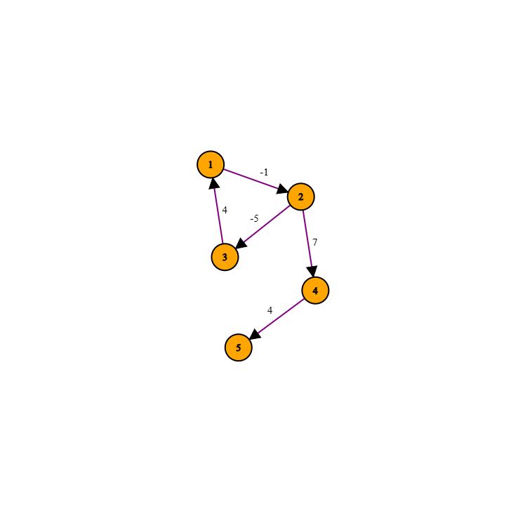

# Giải thích về Code

## Tổng quan
Chương trình này triển khai thuật toán **Floyd-Warshall** để tìm đường đi ngắn nhất giữa tất cả các cặp nút trong đồ thị có hướng hoặc vô hướng với trọng số. Ngoài ra, chương trình còn hỗ trợ tái tạo đường đi ngắn nhất và xử lý các truy vấn từ người dùng.

---

## Các thành phần chính

### 1. **Xử lý đầu vào (`inp` function)**
- Đọc số lượng nút (`n`), số lượng cạnh (`m`), và chế độ đồ thị (`mode`):
  - `mode = 0`: Đồ thị vô hướng.
  - `mode = 1`: Đồ thị có hướng.
- Đọc `m` cạnh, mỗi cạnh được định nghĩa bởi hai nút (`x`, `y`) và trọng số (`w`).
- Lưu các cạnh vào danh sách kề `adj`.

### 2. **Thuật toán Floyd-Warshall (`floyd_warshall` function)**
- Khởi tạo hai ma trận 2D:
  - `dist[i][j]`: Lưu khoảng cách ngắn nhất từ nút `i` đến nút `j`. Giá trị ban đầu là:
    - `0` nếu `i == j`.
    - `INF` nếu không có cạnh trực tiếp giữa `i` và `j`.
  - `next[i][j]`: Lưu nút tiếp theo trên đường đi ngắn nhất từ `i` đến `j`.
- Cập nhật khoảng cách ban đầu dựa trên danh sách kề `adj`.
- Lặp qua tất cả các cặp nút và cập nhật khoảng cách ngắn nhất qua nút trung gian `k`:
  - Nếu tìm thấy đường đi ngắn hơn qua `k`, cập nhật `dist[i][j]` và `next[i][j]`.

### 3. **Xử lý chu trình âm**
- Sau khi chạy Floyd-Warshall, kiểm tra các nút bị ảnh hưởng bởi chu trình âm:
  - Nếu `dist[i][i] < 0`, nút `i` nằm trong chu trình âm.
  - Đánh dấu các nút bị ảnh hưởng để xử lý trong các truy vấn.

### 4. **Tái tạo đường đi (`reconstruct_path` function)**
- Tái tạo đường đi ngắn nhất giữa hai nút `u` và `v` bằng cách sử dụng ma trận `next`.
- Nếu không có đường đi, trả về danh sách rỗng.
- Nếu đường đi bị ảnh hưởng bởi chu trình âm, thông báo cho người dùng.

### 5. **Hàm chính**
- Đọc đầu vào và khởi tạo các ma trận `dist` và `next`.
- Chạy thuật toán Floyd-Warshall để tính toán đường đi ngắn nhất.
- In ma trận khoảng cách ngắn nhất, xử lý các truy vấn, và in kết quả:
  - Khoảng cách ngắn nhất giữa hai nút.
  - Đường đi được tái tạo nếu tồn tại.
  - Thông báo nếu đường đi bị ảnh hưởng bởi chu trình âm.

---

## Quy trình ví dụ

### Đầu vào
Dữ liệu đầu vào từ file `input.txt`:
```
5 5 1
1 2 -1
2 3 -5
3 1 4
2 4 7
4 5 4
1
4 5
```

### Phân tích
1. **Biểu diễn đồ thị**:
   - Số nút: 5
   - Số cạnh: 5
   - Đồ thị có hướng (`mode = 1`).
   - Các cạnh:
     - (1 → 2, -1)
     - (2 → 3, -5)
     - (3 → 1, 4)
     - (2 → 4, 7)
     - (4 → 5, 4)

2. **Ma trận khoảng cách ban đầu**:
   - Các cạnh trực tiếp được khởi tạo với trọng số tương ứng.
   - Các nút không kết nối trực tiếp được gán giá trị `INF`.
   - Đường đi từ một nút đến chính nó được gán giá trị `0`.

  - Ma trận khoảng cách ngắn nhất:
<div align="center">

  | i\j |   1   |   2   |   3   |   4   |   5   |
  |:----:|:-----:|:-----:|:-----:|:-----:|:-----:|
  |  1   | -INF  | -INF  | -INF  | -INF  | -INF  |
  |  2   | -INF  | -INF  | -INF  | -INF  | -INF  |
  |  3   | -INF  | -INF  | -INF  | -INF  | -INF  |
  |  4   |  INF  |  INF  |  INF  |   0   |   4   |
  |  5   |  INF  |  INF  |  INF  |  INF  |   0   |

</div>

4. **Truy vấn**:
   - Truy vấn: Tìm đường đi ngắn nhất từ nút `4` đến nút `5`.
     - Khoảng cách: `4`.
     - Đường đi: `4 → 5`.

### Đầu ra
```
Floyd-Warshall Algorithm for directed graph.
Matrix of shortest distances:
    i\j    1    2    3    4    5
      1 -INF -INF -INF -INF -INF
      2 -INF -INF -INF -INF -INF
      3 -INF -INF -INF -INF -INF
      4  INF  INF  INF    0    4
      5  INF  INF  INF  INF    0

Shortest distance from 4 to 5: 4
Path: 4 5
```
<br>
<div align="center">

</div>

--- 

## Độ phức tạp

### Độ phức tạp thời gian
- **Khởi tạo**: \(O(n^2)\)
- **Thuật toán Floyd-Warshall**: \(O(n^3)\)
- **Tái tạo đường đi**: \(O(n)\) cho mỗi truy vấn

### Độ phức tạp không gian
- Danh sách kề: \(O(m)\)
- Ma trận khoảng cách và ma trận `next`: \(O(n^2)\)

---

## Ghi chú
- Chương trình hỗ trợ cả đồ thị có hướng và vô hướng.
- Chu trình âm được phát hiện và xử lý để đảm bảo kết quả chính xác.
- Hằng số `INF` đại diện cho trạng thái không thể đạt được.
- Ký hiệu `-INF` đại diện cho đường đi bị ảnh hưởng bởi ít nhất một chu trình âm.
- Các truy vấn được xử lý tuần tự để in kết quả.
